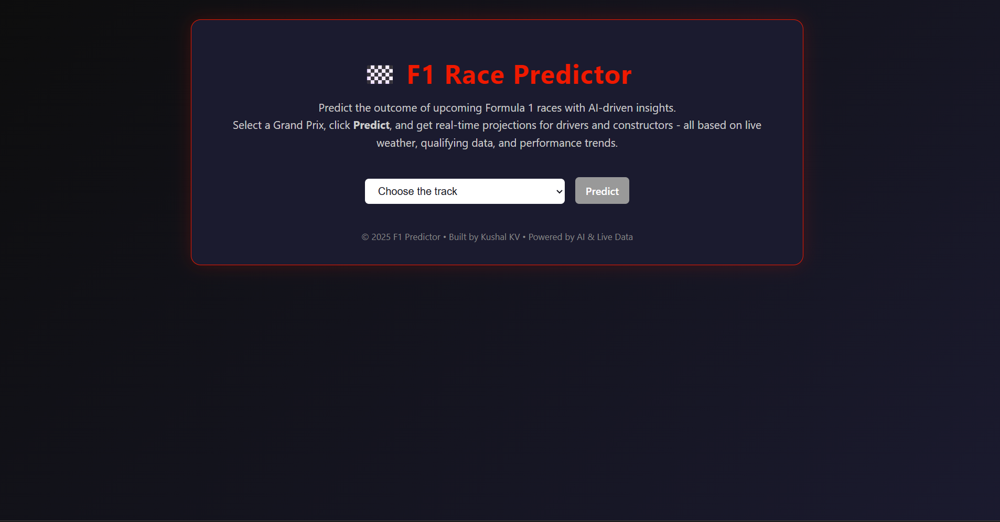
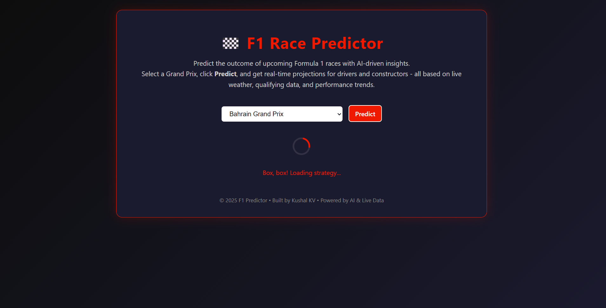
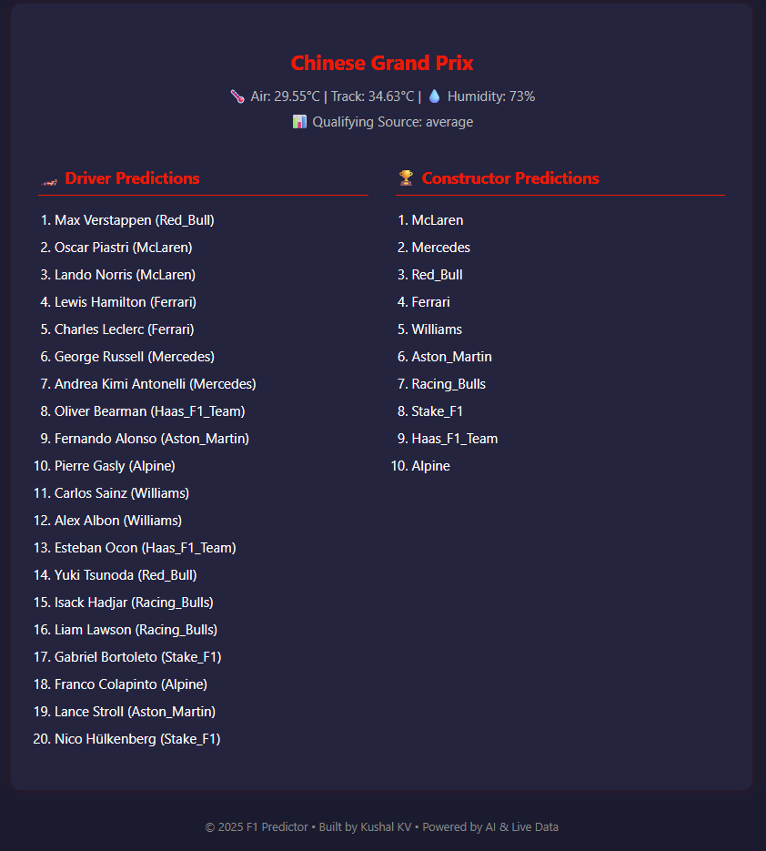

# 🏎 F1 Race Predictor

Predict the outcomes of Formula 1 races for the 2025 season using machine learning, historical race data, and real-time weather & qualifying inputs. This project predicts both **driver positions** and **constructor points** for upcoming races.

---

## 🎯 Features

- **Driver Position Prediction:** Predicts the finishing positions of each driver.
- **Constructor Points Prediction:** Estimates total points for each constructor based on driver performances.
- **Real-Time Weather Integration:** Automatically fetches current weather data for the race track.
- **Fallback Mechanism:** Uses historical averages if real-time data is unavailable.
- **Dynamic Input Handling:** Only requires track name as input; all other features are auto-computed.
- **User-Friendly Interface:** Interactive frontend allowing easy selection of track and visualization of results.

---

## 🛠 Tech Stack

- **Backend:** Python, FastAPI (API endpoints for predictions)
- **Machine Learning:** Scikit-learn (RandomForestRegressor)
- **Data Handling:** Pandas, NumPy
- **APIs:** OpenWeatherMap for real-time weather, Ergast API for qualifying positions
- **Frontend:** HTML, CSS, JavaScript (Netlify deployment)
- **Deployment:** Render (Backend), Netlify (Frontend)
- **Version Control:** Git & GitHub

---

## 💡 Additional Highlights

- **Feature Engineering:** Automatic encoding of categorical features such as drivers and constructors.
- **Robust Prediction Logic:** Combines historical averages and real-time inputs to handle missing or delayed data.
- **Modular Codebase:** Easily extendable for future F1 seasons or adding more predictive features (e.g., pit stops, lap times, tire strategies).
- **Reproducibility:** All data preprocessing, model training, and prediction pipelines are saved for consistent results across deployments.

---

## 📊 Demo: Prediction Workflow

**Step 1:** Choose the track

**Step 2:** Click "Predict" to generate results

**Step 3:** View prediction output

**Video Demo:**

[Watch Demo Video](https://drive.google.com/file/d/1QVeSlmGmO4rCUjEvcA6mtx2B6EHOuo4v/view?usp=sharing)

---

## ✅ Key Highlights

* Fully automated input handling — user only enters track name.
* Accurate mapping of team names and points for the 2025 season.
* Works with real-time weather and qualifying APIs.
* Designed for deployment on Render & Netlify.

---

## 📜 License

MIT License © 2025 Kushal KV

---

## 📬 Contact

* GitHub: [https://github.com/kvkushal](https://github.com/kvkushal)
* Email: [kushalkv2004@gmail.com](mailto:kushalkv2004@gmail.com)
